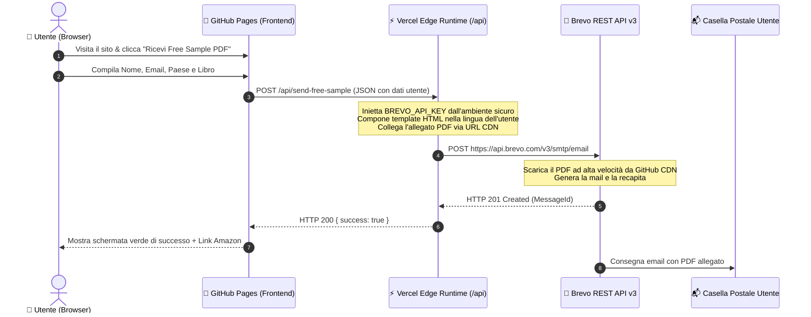

# 🎨 Cozy Coloring Chaos — Documentazione Architetturale & Flusso Invio Free Sample

Benvenuto nella documentazione tecnica e architetturale ufficiale di **Cozy Coloring Chaos**.
Questo documento è redatto sia ad uso umano (per comprendere l'architettura, le decisioni di design e la manutenzione) sia come riferimento per gli agenti AI nelle future sessioni di sviluppo.

---

## 1. 🌐 Panoramica ad Alto Livello (High-Level Architecture)

Il progetto adotta un'architettura **JAMstack Decoupled & Serverless**, sicura al 100% e a costo zero di infrastruttura:



### Componenti Principali:
1. **Frontend Statico (GitHub Pages)**:
   * Ospitato su `https://indiebookstudio.github.io/cozy-coloring-chaos/`.
   * Interfaccia utente interattiva, catalogo libri, selezione automatica e manuale di 14 mercati Amazon e 9 lingue.
   * **Zero segreti o chiavi API nel codice client**.
2. **Backend Serverless (Vercel Edge Functions)**:
   * Endpoint: `https://cozy-coloring-chaos-saluccimarco-3318s-projects.vercel.app/api/send-free-sample`.
   * Eseguito su **Vercel Edge Runtime** globale (avvio in < 1ms, standard Web `Request`/`Response`).
   * Custodisce la variabile d'ambiente `BREVO_API_KEY`.
3. **Provider Transazionale (Brevo / Sendinblue)**:
   * Invia l'email con il template personalizzato e il PDF in allegato scaricato direttamente dalla CDN di GitHub.

---

## 2. 🔐 Sicurezza & Gestione dei Segreti

### La Regola Fondamentale
> **`BREVO_API_KEY` non deve MAI trovarsi nel frontend, nel codice JavaScript del browser o nel repository Git.**

### Come è garantita la sicurezza:
* **Repository Pulito**: Il file `.gitignore` esclude qualsiasi file `.env`, `.env.*` o credenziale locale.
* **Isolamento dell'Ambiente di Produzione**: Su Vercel, la chiave è archiviata in modo cifrato nelle **Environment Variables** (`Project Settings > Environment Variables > BREVO_API_KEY`) ed è accessibile unicamente dal backend serverless durante l'esecuzione della funzione.
* **CORS Permissivo Controllato**: L'endpoint accetta richieste solo per i metodi autorizzati (`GET`, `POST`, `OPTIONS`) restituendo sempre intestazioni CORS corrette.
* **Validazione Dati**: Tutti i campi (`email`, `firstName`, `lastName`, `countryCode`, `bookId`) vengono ripuliti, sanitizzati e validati lato server prima di qualsiasi interazione esterna.

---

## 3. 📦 La Catena di Invio del PDF in Allegato (Deep Dive)

### Il problema architetturale dei PDF pesanti in Serverless
Inizialmente, caricare il file PDF (circa 1.9 MB) in memoria RAM all'interno di una funzione serverless e convertirlo in Base64 per inviarlo come payload JSON da oltre 2.6 MB causava ritardi, timeout ed errori di invocazione su Vercel (`INTERNAL_FUNCTION_INVOCATION_FAILED`).

### La Soluzione Adottata (CDN Attachment URL)
Brevo supporta nativamente l'invio di allegati tramite **URL pubblico (CDN)**:

```javascript
attachment: [
  {
    name: "Impossible-Worlds-Free-Sample.pdf",
    url: "https://indiebookstudio.github.io/cozy-coloring-chaos/assets/Impossible.Worlds/Sample/Free.Sample.pdf"
  }
]
```

#### I vantaggi di questa architettura:
1. **Zero RAM e Zero Carico su Vercel**: La funzione serverless invia solo un piccolo JSON da 1 KB a Brevo in appena **80-100 millisecondi**.
2. **Download ad Altissima Velocità**: Brevo effettua il download del file PDF direttamente dai server distribuiti di GitHub Pages (Fastly CDN) e lo allega all'email all'istante.
3. **Affidabilità 100%**: Nessun rischio di timeout né di limiti di memoria delle funzioni serverless.

---

## 4. 🌍 Internazionalizzazione & Marketplace Amazon

L'architettura include un motore di localizzazione automatico sincronizzato tra frontend e backend:

### 1. Mercati Amazon Supportati (14 Paesi)
| Codice | Paese | Dominio Amazon | Valuta / Flag |
| :--- | :--- | :--- | :--- |
| `us` | United States | `amazon.com` | 🇺🇸 USD |
| `uk` | United Kingdom | `amazon.co.uk` | 🇬🇧 GBP |
| `de` | Deutschland / AT / CH | `amazon.de` | 🇩🇪 EUR |
| `fr` | France / BE | `amazon.fr` | 🇫🇷 EUR |
| `es` | España / MX | `amazon.es` | 🇪🇸 EUR |
| `it` | Italia | `amazon.it` | 🇮🇹 EUR |
| `nl` | Nederland | `amazon.nl` | 🇳🇱 EUR |
| `pl` | Polska | `amazon.pl` | 🇵🇱 PLN |
| `se` | Sverige | `amazon.se` | 🇸🇪 SEK |
| `be` | Belgique | `amazon.com.be` | 🇧🇪 EUR |
| `ie` | Ireland | `amazon.ie` | 🇮🇪 EUR |
| `jp` | Japan | `amazon.co.jp` | 🇯🇵 JPY |
| `ca` | Canada | `amazon.ca` | 🇨🇦 CAD |
| `au` | Australia | `amazon.com.au` | 🇦🇺 AUD |

### 2. Lingue Email Supportate (9 Lingue)
Il backend genera automaticamente l'email HTML responsive nella lingua corretta:
* **Italiano (`it`)**
* **Inglese (`en`)**
* **Tedesco (`de`)**
* **Francese (`fr`)**
* **Spagnolo (`es`)**
* **Olandese (`nl`)**
* **Polacco (`pl`)**
* **Svedese (`sv`)**
* **Giapponese (`ja`)**

Ogni email include:
* Oggetto personalizzato con il titolo del libro richiesto.
* Saluto nominativo (`Ciao Nome Cognome!`).
* Badge visivo *"📎 File PDF allegato a questa email"*.
* Copertina ufficiale in alta definizione con link al marketplace Amazon di appartenenza.
* Pulsante CTA tracciato per acquistare la versione cartacea completa su Amazon.
* Copia automatica in CC invisibile al team di Cozy Coloring Chaos (`cozycoloringchaos@gmail.com`).

---

## 5. 📁 Mappa e Struttura dei File del Progetto

```text
cozy-coloring-chaos/
├── .env.example             <- Template pulito per le variabili d'ambiente
├── .gitignore               <- Ignora .env, node_modules e file temporanei
├── ARCHITECTURE.md          <- Questa documentazione tecnica
├── index.html               <- Frontend: HTML5 semantico, modali, catalogo libri
├── style.css                <- CSS3: Design system, dark/warm palette, responsive
├── script.js                <- JS Client: Gestione stato UI, switch lingua, invio form
├── package.json             <- Configurazione progetto ESM nativo
├── vercel.json              <- Configurazione per il deployment Vercel
├── local-server.js          <- Server Node locale per sviluppo su http://localhost:3000
├── test-endpoint.js         <- Test suite automatizzata (CORS, validazione, segreti)
├── api/
│   └── send-free-sample.js  <- Edge Serverless Handler (chiamata a Brevo REST API v3)
└── assets/
    ├── Impossible.Worlds/
    │   ├── Front.Cover.png
    │   └── Sample/Free.Sample.pdf
    ├── Italian.Girls/
    │   ├── Front.Cover.png
    │   └── Sample/Free.Sample.pdf
    ├── Innocent.Paws/
    │   ├── Front.Cover.png
    │   └── Sample/Free.Sample.pdf
    ├── Killer.Paws/
    │   ├── Front.Cover.png
    │   └── Sample/Free.Sample.pdf
    └── Non.Rompetemi.I.Coglioni/
        ├── Front.Cover.png
        └── Sample/Free.Sample.pdf
```

---

## 6. 🛠️ Guida per Future Modifiche ed Estensioni

### Come aggiungere un nuovo libro al catalogo:
1. Crea la cartella in `assets/Nome.Libro/` contenente `Front.Cover.png` e `Sample/Free.Sample.pdf`.
2. Aggiungi la definizione del libro sia in [`script.js`](file:///c:/Users/Marco/Documents/GitHub/cozy-coloring-chaos/script.js) (array `BOOKS`) sia in [`api/send-free-sample.js`](file:///c:/Users/Marco/Documents/GitHub/cozy-coloring-chaos/api/send-free-sample.js) (array `BOOKS`):
   ```javascript
   {
     id: "mio-nuovo-libro",
     title: "Mio Nuovo Libro",
     subtitle: "Descrizione...",
     author: "Isaac McClour",
     cover: "assets/Mio.Nuovo.Libro/Front.Cover.png",
     samplePdf: "assets/Mio.Nuovo.Libro/Sample/Free.Sample.pdf",
     defaultMarket: "us",
     asin: "B0XXXXXXX"
   }
   ```

### Come testare in locale prima di pubblicare:
1. Assicurati che nel file `.env` sia presente la chiave:
   ```bash
   BREVO_API_KEY=xkeysib-...
   ```
2. Esegui la suite di test automatizzati:
   ```bash
   node test-endpoint.js
   ```
3. Avvia il server locale di sviluppo:
   ```bash
   npm start
   # oppure: node local-server.js
   ```
4. Apri `http://localhost:3000` nel browser per testare l'invio reale del PDF.

### Come aggiornare la chiave API Brevo (se necessario):
Non serve toccare una sola riga di codice:
1. Vai su: **[Vercel Project Settings > Environment Variables](https://vercel.com/saluccimarco-3318s-projects/cozy-coloring-chaos/settings/environment-variables)**.
2. Modifica il valore di `BREVO_API_KEY`.
3. Clicca su **Redeploy** dell'ultimo deployment per rendere attiva la nuova chiave.
